# Docker Compose Architecture - Real Estate ML Platform

## Overview

This document describes the containerized architecture implemented for the Real Estate Machine Learning Platform using Docker Compose. The system consists of 7 services working together to provide a complete MLOps solution with model training, serving, and monitoring capabilities.

## Architecture Diagram

```mermaid
graph TB
    %% External Access
    User[👤 User/Client]
    Browser[🌐 Browser]

    %% Docker Network
    subgraph "real-estate-network (Docker Bridge Network)"

        %% Storage Layer
        subgraph "Storage Layer"
            PG[(🗄️ PostgreSQL<br/>mlflow-postgres<br/>Port: 5432)]
            MinIO[📦 MinIO<br/>mlflow-minio<br/>Ports: 9000, 9001]
            Volumes[💾 Docker Volumes<br/>- pgdata<br/>- minio-data<br/>- prediction-logs]
        end

        %% Initialization Services
        subgraph "Initialization Services"
            CreateBucket[🪣 Create Bucket<br/>mlflow-create-bucket<br/>One-time setup]
            InitDB[🔧 Init Prediction DB<br/>init-prediction-db<br/>One-time setup]
        end

        %% Core Services
        subgraph "Core Services"
            MLflow[📊 MLflow Server<br/>mlflow-server<br/>Port: 5000]
            API[🚀 Real Estate API<br/>real-estate-api<br/>Port: 8000]
        end
    end

    %% External Connections
    User --> API
    Browser --> MLflow
    Browser --> MinIO

    %% Internal Dependencies
    CreateBucket -.->|depends_on| MinIO
    InitDB -.->|uses| API
    MLflow -.->|depends_on| PG
    MLflow -.->|depends_on| MinIO
    MLflow -.->|depends_on| CreateBucket
    API -.->|depends_on| MLflow
    API -.->|depends_on| InitDB

    %% Data Flow
    MLflow -->|stores metadata| PG
    MLflow -->|stores artifacts| MinIO
    API -->|logs predictions| Volumes
    API -->|loads models| MLflow

    %% Styling
    classDef storage fill:#e1f5fe
    classDef init fill:#fff3e0
    classDef core fill:#e8f5e8
    classDef external fill:#fce4ec

    class PG,MinIO,Volumes storage
    class CreateBucket,InitDB init
    class MLflow,API core
    class User,Browser external
```



## Service Details

### 1. PostgreSQL Database (`mlflow-postgres`)
**Purpose**: MLflow backend store for experiment metadata
- **Image**: `postgres:15`
- **Port**: `5432`
- **Environment**:
  - Database: `mlflow`
  - User: `mlflow`
  - Password: `mlflow`
- **Volume**: `pgdata:/var/lib/postgresql/data`
- **Health Check**: PostgreSQL readiness check
- **Role**: Stores experiment runs, parameters, metrics, and model registry metadata

### 2. MinIO Object Storage (`mlflow-minio`)
**Purpose**: S3-compatible artifact storage for MLflow
- **Image**: `minio/minio:latest`
- **Ports**:
  - `9000`: API endpoint
  - `9001`: Web console
- **Environment**:
  - Root User: `minio`
  - Root Password: `minio123`
- **Volume**: `minio-data:/data`
- **Health Check**: MinIO health endpoint
- **Role**: Stores model artifacts, plots, and other experiment files

### 3. Bucket Creation (`mlflow-create-bucket`)
**Purpose**: Initialize MinIO bucket for MLflow artifacts
- **Image**: `minio/mc:latest`
- **Type**: One-time initialization service
- **Dependencies**: MinIO (healthy)
- **Action**: Creates `mlflow` bucket if it doesn't exist
- **Role**: Ensures artifact storage is ready for MLflow

### 4. Prediction Database Initialization (`init-prediction-db`)
**Purpose**: Set up prediction logging database
- **Image**: Custom build from Dockerfile
- **Type**: One-time initialization service
- **Command**: `python ./api/init_prediction_db.py`
- **Volume**: `prediction-logs:/app/logs`
- **Role**: Prepares database tables for prediction logging

### 5. MLflow Server (`mlflow-server`)
**Purpose**: Central experiment tracking and model registry
- **Image**: `ghcr.io/mlflow/mlflow:v3.1.4`
- **Port**: `5000`
- **Dependencies**: PostgreSQL, MinIO, Bucket Creation
- **Configuration**:
  - Backend Store: PostgreSQL connection
  - Artifact Root: MinIO S3 bucket
  - S3 Endpoint: MinIO server
- **Health Check**: MLflow health endpoint
- **Role**: Provides experiment tracking UI and model registry API

### 6. Real Estate API (`real-estate-api`)
**Purpose**: ML model serving API with prediction logging
- **Image**: Custom build from Dockerfile
- **Port**: `8000`
- **Dependencies**: MLflow Server, Prediction DB Init
- **Configuration**:
  - MLflow Tracking URI: `http://mlflow:5000`
  - Champion Model: `models:/docker_lightgbm_house_price_model/latest`
  - Prediction Logging: Enabled
- **Volume**: `prediction-logs:/app/logs`
- **Health Check**: API health endpoint
- **Role**: Serves ML predictions via REST API with comprehensive logging

## Network Architecture

### Bridge Network: `real-estate-network`
All services communicate through a dedicated Docker bridge network, enabling:
- Service discovery by container name
- Isolated network communication
- Secure inter-service connectivity

### Port Mapping
```
Host → Container
5432 → postgres:5432     (PostgreSQL)
9000 → minio:9000        (MinIO API)
9001 → minio:9001        (MinIO Console)
5000 → mlflow:5000       (MLflow UI)
8000 → api:8000          (Real Estate API)
```

## Data Flow Architecture


## Volume Management

### Persistent Volumes
1. **`pgdata`**: PostgreSQL data persistence
2. **`minio-data`**: MinIO object storage persistence
3. **`prediction-logs`**: API prediction logging persistence

### Data Persistence Strategy
- Database metadata survives container restarts
- Model artifacts remain available across deployments
- Prediction logs accumulate for monitoring and analysis

## Service Dependencies


## Environment Configuration

### Key Environment Variables
- **Database**: PostgreSQL connection parameters
- **Storage**: MinIO credentials and S3 configuration
- **MLflow**: Server settings and artifact configuration
- **API**: Model selection and logging preferences

### Configuration Management
- Centralized in `.env` file
- Environment-specific overrides supported
- Secure credential handling through Docker secrets

## Operational Features

### Health Monitoring
- All services include health checks
- Dependency-based startup ordering
- Automatic restart policies for core services

### Scalability Considerations
- Stateless API design enables horizontal scaling
- Shared storage layer supports multiple API instances
- MLflow server can handle concurrent experiment tracking

### Development vs Production
- Debug mode configurable via environment
- Volume mounts for development iteration
- Production-ready with proper health checks and dependencies

This architecture provides a robust, scalable foundation for machine learning operations with comprehensive experiment tracking, model serving, and operational monitoring capabilities.
